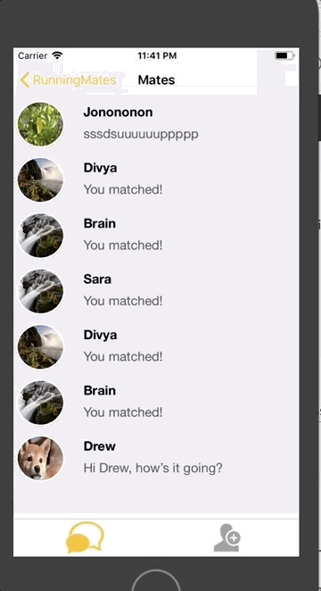

# RunningMates Front End
### Design

### Project Description
RunningMates is a mobile application that utilizes Strava's API to compile personal fitness data to connect individuals looking for new connections with others who share their passions for running. This application uses state-of-art data analytic techniques to provide users with the best recommendations of other runners in their area, based on their skill levels and preferences. This repository contains the front end solution for the app. The front end is written in swift on XCode.

With RunningMates, users can send requests to make connections with other users in their area. If two users request to match with each other, RunningMates connects them through a chat, through which they can plan to meet up to run together.  

In addition to their name and age, users can choose to display information to potential matches such as a profile picture a bio, number of miles they run a week, and number of times they run a week. This information can be updated through the Settings page, which is linked through the Dashboard. Users can link their Strava accounts if they sign up; if they do, information about their running statistics will automatically be synced with their profile.  

Additionally, users can update preferences regarding the types of users they would like to connect with. These preferences include gender, age, proximity, number of runs each week, and average weekly mileage. RunningMates takes these preferences into account in order to display the best potential matches possible to each user.

### Dependencies

Dependencies are managed by cocoa pods.
To install cocoa pods:
`$sudo gem install cocoapods`

## Setup

* Git clone this repo into your local directory.
* Run `$pod install`
* Run `$open RunningMates.xcworkspace`
* Run the project on any iPhone simulator

## Debrief
Overall, we are very proud of how far we have come. When we started this project none of us had any experience with Swift or Xcode, so have learned a lot and had a lot of fun in the process. One thing that worked for us was having milestones to meet every week: this helped us focus on what was highest priority. We also thought it was good that we were encouraged to meet our stretch goal of adding safety tracking, because it lets us show our users that we care about their safety. Somethings that didn't work were we were not able to get our app on the App Store yet (but we aren't going to stop trying!). In general Testflight caused a LOT of headaches, and we think future classes would have a better experience if the process of publishing was made simpler. Our next steps are to keep pushing to the App Store until we get approved, and then recruiting more users! Also, we would like to add some more third party APIs (like Apple Health) to our app. Thanks for all your help Tim, we couldn't have done it without you!

## Authors
* Brian Francis
* Jonathan Gonzalez
* Divya Kalidindi
* Sara Topic
* Drew Waterman
* Shea Wojciehowski

## Acknowledgments
* The team acknowledges Tim Tregubov.
